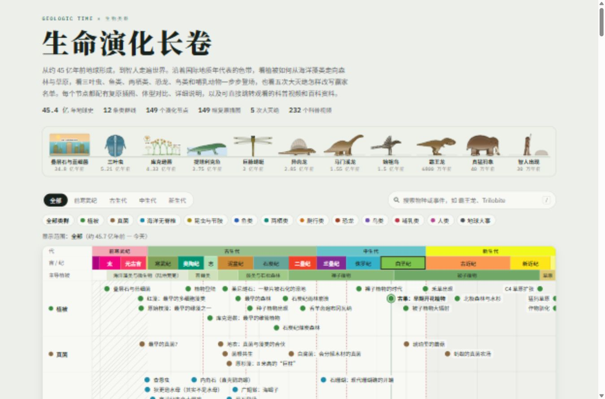
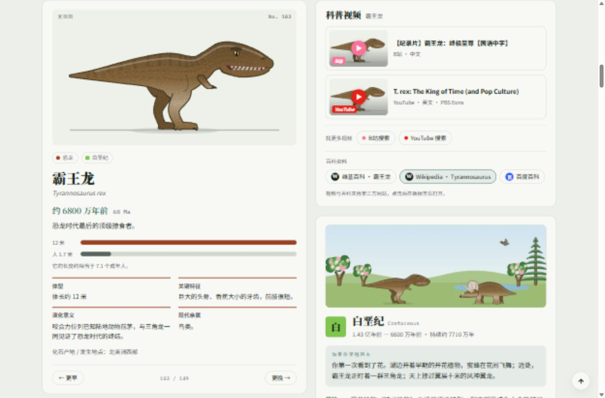

# 生命演化长卷 · Life Evolution Atlas

**一幅可以点击、搜索和探索的生命演化长卷。** 从地球形成、早期海洋和生命迹象，到森林出现、恐龙时代、哺乳动物兴起与人类文化，把约 45 亿年的地球历史放在同一张交互式时间轴上。

这是一个中文静态科普网页作品。页面以地质年代色带为骨架，将主导植被、12 条类群线、149 个演化节点、程序化 SVG 插图、时期景观、体型对比、科普资料入口和生命之树连接起来。既可以按年代从早到晚阅读，也可以直接搜索自己感兴趣的生物或事件。

无需安装前端依赖、注册账号或连接后端：**点开下方的在线链接就能直接使用**，也可以下载到本地离线浏览。

<p align="center">
  <a href="https://johnhuasheng.github.io/life-evolution-atlas/"></a>
  <a href="https://raw.githack.com/johnhuasheng/life-evolution-atlas/main/index.html"></a>
  <a href="https://raw.githack.com/johnhuasheng/life-evolution-atlas/main/%E7%94%9F%E5%91%BD%E6%BC%94%E5%8C%96%E9%95%BF%E5%8D%B7_%E5%8D%95%E6%96%87%E4%BB%B6.html"></a>
</p>

## 在线体验（点开即用，无需下载）

| 入口 | 链接 | 说明 |
| --- | --- | --- |
| **在线演示（推荐）** | **<https://johnhuasheng.github.io/life-evolution-atlas/>** | GitHub Pages 正式网址，打开即是完整网页 |
| 备用在线链接 | [https://raw.githack.com/johnhuasheng/life-evolution-atlas/main/index.html](https://raw.githack.com/johnhuasheng/life-evolution-atlas/main/index.html) | 直接从本仓库读取最新文件，无需任何设置即可使用 |
| 单文件在线版 | [生命演化长卷_单文件.html（在线打开）](https://raw.githack.com/johnhuasheng/life-evolution-atlas/main/%E7%94%9F%E5%91%BD%E6%BC%94%E5%8C%96%E9%95%BF%E5%8D%B7_%E5%8D%95%E6%96%87%E4%BB%B6.html) | 所有样式、脚本、插图合在一个文件里 |

**直接跳到某个节点**（在网址后加 `#插图名`）：

- 霸王龙：<https://johnhuasheng.github.io/life-evolution-atlas/#trex>
- 风神翼龙：<https://johnhuasheng.github.io/life-evolution-atlas/#quetzal>
- 三叶虫：<https://johnhuasheng.github.io/life-evolution-atlas/#trilobite>
- 始祖鸟：<https://johnhuasheng.github.io/life-evolution-atlas/#archaeopteryx>
- 智人出现：<https://johnhuasheng.github.io/life-evolution-atlas/#sapiens>

> 手机、平板、电脑的浏览器都能直接打开。页面中的科普视频会跳转到 B站 / YouTube 观看，百科链接跳转到维基百科 / 百度百科。



## 项目一览

| 项目 | 当前内容 |
| --- | --- |
| 历史跨度 | 约 45 亿年；全景时间轴刻度从 4567 Ma 延伸到今天 |
| 类群线 | 12 条，包含生物类群与地球大事 |
| 演化节点 | 149 个，每个节点都有对应插图 |
| 时期场景 | 16 个，从冥古宙到第四纪 |
| 大灭绝 | 5 次，以时间轴标记和事件详情呈现 |
| 视频资料 | 232 条预置的 B站 / YouTube 视频链接，涵盖 146 个节点 |
| 补充资料 | 中文 / 英文维基百科、百度百科，以及视频搜索入口 |
| 交付形式 | 多文件源码版 + 可直接分享的单文件 HTML 版 |
| 技术 | HTML、CSS、原生 JavaScript、SVG；辅助工具使用 Python |

以上数量根据本次上传版本的实际数据统计。视频数量指配置中的链接条目，包含部分相关主题的视频；其余节点会提供搜索入口。

## 快速开始

### 方式零：在线打开（最简单）

直接访问 **<https://johnhuasheng.github.io/life-evolution-atlas/>**，不需要下载任何文件。如果该地址暂时打不开，可使用上方的“备用在线链接”。

### 方式一：下载整个项目

1. 在仓库页面点击 **Code → Download ZIP**。
2. 解压 ZIP，进入包含 `index.html` 的文件夹。
3. 双击 `index.html`，或在 Windows 中双击 `打开网页.bat`。
4. 保持 `index.html`、两个 CSS 文件和 `js/` 文件夹的相对位置，即可正常浏览。

### 方式二：只用单文件版

下载仓库根目录的 [`生命演化长卷_单文件.html`](生命演化长卷_单文件.html)，用浏览器打开。它已经内联页面样式、交互脚本和插图数据，不需要再下载 `js/` 文件夹，适合发送给朋友、存入资料包或随身携带。

在 GitHub 文件页面使用 **Download raw file** 下载原始文件；直接浏览 GitHub 的源码页面不会运行网页。

### 方式三：克隆并通过本地服务打开

```powershell
git clone https://github.com/johnhuasheng/life-evolution-atlas.git
cd life-evolution-atlas
python -m http.server 8000 --bind 127.0.0.1
```

然后在浏览器中访问 `http://127.0.0.1:8000/`。本地服务是可选方式，直接打开 HTML 也可以使用核心功能；运行以上命令需要安装 Git 和 Python。

**网络使用：** 时间轴、插图、搜索、筛选、详情、图鉴和生命之树均由本地文件实现。页面会尝试加载 Google Fonts，无法联网时使用系统备用字体。观看第三方视频、使用在线搜索和阅读百科需要网络访问相应网站。

## 网页怎么用

### 1. 先看顶部的“生命行进”

标题下方排列着叠层石、三叶虫、库克逊蕨、提塔利克鱼、巨脉蜻蜓、异齿龙、马门溪龙、始祖鸟、霸王龙、猛犸象和智人等代表性节点。点击其中任意一项，即可打开对应详情。

这一排插图适合快速认识生命史中的几个重要变化，也可以作为初次浏览的入口。手机上可以横向滑动查看。

### 2. 选择时间范围

页面提供 **全部、前寒武纪、古生代、中生代、新生代** 五个快捷范围。点击时间轴上方的地质年代色带，还可以进入具体的宙或纪，例如寒武纪、侏罗纪、白垩纪和第四纪。

时间轴将年代色带、主导植被和各条类群线放在同一位置，方便对照“某种生物出现时，世界处于哪个时期，地面上主要长着什么植物”。

“全部”视图使用分段比例：前寒武纪被压缩，新生代被放大，以便同时看清漫长的早期历史和近代较密集的节点。页面会显示比例提示。**全景轴上的相同像素距离不代表相同的时间长度。**

### 3. 筛选感兴趣的类群

顶部的类群按钮可以控制时间轴和图鉴中的内容：

- **单击**某一类群：切换显示 / 隐藏。
- **双击**某一类群：只显示这一类。
- 点击 **全部类群**：恢复全部内容。

例如，选择“中生代”并双击“恐龙”，就可以集中浏览该时期的 12 个恐龙节点。页面至少保留一个类群，避免出现完全空白的筛选结果。

### 4. 点击节点阅读详情

时间轴上的圆点、顶部代表性插图、图鉴卡片，以及时期卡中的节点按钮，都可以打开详情。桌面端将鼠标移到时间轴节点上，还会显示名称、年代和插图预览。

详情卡按节点类型显示：

- 中文名称、学名或英文名称，以及距今时间。
- 对应的 SVG 复原图或事件示意图。
- 简介、体型 / 规模、关键特征 / 原因、演化意义 / 影响。
- 现代亲属、与我们的关系或今天仍能观察到的线索。
- 数据中记录的化石产地或事件发生地点。
- 对于带有长度数据的节点，用条形图与 **1.7 米成年人**进行比较。

节点涉及生物、植物、地质事件和文化事件，因此字段会随内容调整，并非每个节点都有体型对比。



### 5. 搜索物种或事件

搜索支持中文名称、学名、配置中的英文百科名称、类群名称，以及节点简介中的文字。

可以尝试输入 `霸王龙`、`Trilobite`、`Archaefructus` 或 `大氧化`。候选列表会同时显示插图、名称、年代和类群，便于确认目标。

| 操作 | 效果 |
| --- | --- |
| `/` | 聚焦搜索框 |
| 搜索框内 `↑` / `↓` | 在候选结果中移动 |
| 搜索框内 `Enter` | 打开当前候选节点 |
| 搜索框内 `Esc` | 关闭搜索结果并退出搜索框 |
| 页面上 `←` / `→` | 按时间顺序浏览当前所选类群的前一个 / 后一个节点 |
| 详情中的“更早 / 更晚” | 与前后节点浏览对应 |

搜索框正在输入时，左右方向键保留正常的文本编辑行为。前后浏览依据当前类群筛选；必要时页面会调整时间范围，让所选节点可见。

### 6. 了解当时的世界

与节点详情联动的时期卡包含：

- 对应地质时期的中英文名称、年代范围和持续时间。
- 由植物和动物插图组成的景观场景。
- “**如果你穿越回去**”的情境描述。
- 当时的植被、动物与气候概况。
- 当前所选类群中属于这一时期的节点入口。

这部分可以把单个化石或事件放回环境背景中理解。例如，研究石炭纪的巨型节肢动物时，还可以一起查看煤炭森林和当时的气候描述。

### 7. 浏览物种图鉴和生命之树

**物种图鉴**按时期排列节点卡片，并随上方时间范围和类群筛选变化。卡片同时包含插图、名称、年代和类群；其中也收录地球事件及文化事件，便于从图像入口阅读全部内容。

**生命之树**位于页面下方，用对数时间轴展示主要类群的分化关系。越靠右越接近今天，带虚线与 `†` 标记的末端表示已灭绝类群。它呈现的是主要分支的科普示意，并非所有物种的完整系统发育树。

### 8. 查阅视频与百科

选择节点后，科普资料区会显示预置视频链接、B站 / YouTube 搜索入口，以及百科链接。没有预置视频的节点会显示搜索入口；部分视频会标注“相关主题”。

点击后会在新标签页打开第三方网站。**视频没有下载或内嵌进这个项目，插图式卡片只是跳转入口。** 页面中窄屏布局还提供“观看科普视频 · 查百科”按钮，用于快速滚动到资料区。

### 9. 直接打开某个节点

网页使用插图标识作为 URL 片段。选择节点后，地址会更新，便于保存或分享：

```text
index.html#trex          霸王龙
index.html#quetzal       风神翼龙
index.html#trilobite     三叶虫
```

单文件版也支持相同的片段，例如 `生命演化长卷_单文件.html#trex`。本地文件地址只能在拥有该文件的电脑上使用；通过 HTTP 托管时，可把相同片段附加到网页地址。

## 内容覆盖

| 类群线 | 节点数 | 内容举例 |
| --- | ---: | --- |
| 植被 | 19 | 叠层石与蓝细菌、植物登陆、最早的森林、古果、草原扩张、作物驯化 |
| 真菌 | 7 | 早期真菌、地衣、菌根共生、原杉藻、白腐菌、蚂蚁的真菌农场 |
| 海洋无脊椎 | 10 | 埃迪卡拉生物、寒武纪大爆发、三叶虫、奇虾、菊石、石珊瑚 |
| 昆虫与节肢 | 10 | 动物呼吸空气、昆虫飞行、节胸蜈蚣、巨脉蜻蜓、甲虫、蜜蜂与花 |
| 鱼类 | 10 | 昆明鱼、盔甲鱼、有颌鱼、腔棘鱼、鲨鱼、邓氏鱼、巨齿鲨 |
| 两栖类 | 8 | 提塔利克鱼、棘螈与鱼石螈、引螈、早期蛙类与蝾螈 |
| 爬行类 | 11 | 林蜥、鱼龙、翼龙、早期龟类、蛇颈龙、沧龙、风神翼龙 |
| 恐龙 | 12 | 始盗龙、禄丰龙、马门溪龙、剑龙、中华龙鸟、棘龙、霸王龙、三角龙 |
| 鸟类 | 11 | 近鸟龙、始祖鸟、孔子鸟、早期企鹅、冠恐鸟、阿根廷巨鹰、恐鸟 |
| 哺乳类 | 18 | 下孔类、异齿龙、犬颌兽、早期哺乳动物、古鲸、巨犀、剑齿虎、猛犸象 |
| 人类 | 14 | 早期人类支系、石器、露西、直立人、用火、北京人、智人、洞穴艺术、文字 |
| 地球大事 | 19 | 地球形成、海洋、氧化事件、雪球地球、板块变化、五次大灭绝、冰期 |

16 个时期场景依次为：**冥古宙、太古宙、元古宙、埃迪卡拉纪、寒武纪、奥陶纪、志留纪、泥盆纪、石炭纪、二叠纪、三叠纪、侏罗纪、白垩纪、古近纪、新近纪、第四纪**。

类群线用于组织阅读，其中“植被”和“地球大事”包含主题事件；这些分组不等同于严格的分类阶元，也不表示全部节点之间存在直接祖先关系。

## 网页特点

- **长卷式信息结构：** 将年代、植被与不同生物类群放在可对照的横向时间轴中，同时保留更详细的阅读区。
- **标本图鉴式视觉：** 使用浅灰绿色底色、衬线中文标题、年代色带和类群配色，使插图、年代与正文形成清楚的阅读层次。
- **程序化 SVG 插图：** 图形由项目脚本绘制，支持缩放，核心展示不依赖远程图片资源。插图工具包含有机体形、毛发、鳞片、树冠和纹理等绘制方法。
- **筛选与图鉴联动：** 时间范围和类群选择同时影响时间轴与图鉴；选择节点则更新详情和对应时期资料。
- **多种浏览入口：** 可沿时间轴探索，也可以搜索、翻阅图鉴、查看时期节点，或使用 URL 片段直达。
- **适配窄屏：** 详情区在小屏幕中改为纵向排列，时间轴和生命之树保留横向滚动，便于查看完整结构。
- **系统主题适配：** 跟随系统的浅色 / 深色偏好，并响应减少动态效果的设置。
- **静态交付：** 无需 npm 安装、构建步骤、数据库或 API 密钥；附带单文件打包与插图总览工具。

## 文件结构

```text
life-evolution-atlas/
├─ index.html                    页面骨架与模块入口
├─ style.css                     主页面、时间轴、卡片与响应式样式
├─ art.css                       插图通用样式
├─ README.md                     GitHub 项目介绍与使用指南
├─ .nojekyll                     让 GitHub Pages 原样发布全部文件
├─ 项目说明.md                   原有本地使用与修改说明
├─ 打开网页.bat                  Windows 快捷打开入口
├─ 生命演化长卷_单文件.html       已打包的独立网页
├─ js/
│  ├─ artkit.js                  SVG 插图绘制工具
│  ├─ art-*.js                   按主题拆分的插图定义
│  ├─ data1.js                   类群、年代、植被和时期文字
│  ├─ data2.js / data3.js         演化节点及详细信息
│  ├─ media.js                   视频链接与百科条目配置
│  ├─ scenes.js                  时期景观场景
│  ├─ tree.js                    生命之树分支与时间数据
│  └─ app.js                     搜索、时间轴、筛选和展示逻辑
├─ docs/images/                  README 页面截图
├─ 工具/
│  ├─ 打包单文件.py              更新单文件版
│  ├─ contact.py                 生成插图总览
│  └─ 插图总览.html              当前插图检查页
└─ 旧版/
   ├─ 生命演化长卷_第一版.html   历史版本
   └─ 第二版插图/               历史插图脚本，当前页面不加载
```

## 复刻并发布你自己的在线版

这个项目是纯静态网页，没有构建步骤，复刻后几分钟就能拥有自己的在线网址：

1. 点击仓库右上角 **Fork**，把项目复制到自己的 GitHub 账号下（或下载 ZIP 后新建仓库上传全部文件）。
2. 在你的仓库中打开 **Settings → Pages**。
3. **Build and deployment → Source** 选择 **Deploy from a branch**；**Branch** 选择 `main`，文件夹选择 `/ (root)`，点击 **Save**。
4. 等待 1～2 分钟，页面顶部会显示网址：`https://你的用户名.github.io/仓库名/`，打开即可访问。
5. 之后修改任何文件并提交，网站会自动更新。

仓库根目录的 `.nojekyll` 文件用于让 GitHub Pages 原样发布所有文件（包括中文文件名），请保留。

**不想开 GitHub Pages？** 也可以用 `https://raw.githack.com/你的用户名/仓库名/main/index.html` 的形式直接在线打开任意公开仓库中的网页。

其他可选托管方式：把整个文件夹拖进 [Netlify Drop](https://app.netlify.com/drop)，或导入到 [Vercel](https://vercel.com/new) / [Cloudflare Pages](https://pages.cloudflare.com/)，均无需任何构建设置（构建命令留空，输出目录为根目录）。

## 修改与扩展

### 修改节点内容

在 `js/data2.js` 或 `js/data3.js` 中寻找目标节点。常见字段如下：

| 字段 | 含义 |
| --- | --- |
| `t` | 距今时间，单位为百万年（Ma） |
| `l` | 所属类群线 ID |
| `a` | 插图标识，同时用于节点 URL 片段 |
| `n` / `s` | 中文名称 / 学名或英文名称 |
| `d` | 简介 |
| `z` / `len` | 体型描述 / 用于比较的长度，`len` 单位为米 |
| `f` / `g` / `r` | 关键特征、意义、现代亲属等对应信息 |
| `w` | 化石产地或发生地点 |
| `x` | 大灭绝事件标记 |
| `p` | 显式指定的时期 ID；未指定时按年代判断 |

新增节点时，使用现有格式，并让 `a` 对应插图脚本中的定义。若需要该节点独立的直达地址，应使用独立的插图标识。类群线、时期和场景描述位于 `js/data1.js`。

### 添加视频

在 `js/media.js` 中寻找目标插图标识，在其 `v` 列表中添加条目，例如：

```javascript
{ p: 'b', t: '视频标题', u: 'https://www.bilibili.com/video/实际视频编号' }
```

`p: 'b'` 表示 B站，`p: 'y'` 表示 YouTube；`w` 可填写频道信息，`r: 1` 表示视频属于相关主题。示例链接是格式占位，添加时需要替换为实际核对过的链接。

### 修改插图并重新打包

按主题在 `js/art-*.js` 中查找插图标识，如 `ART.trex`。修改后，在仓库根目录运行：

```powershell
python "工具/contact.py"
python "工具/打包单文件.py"
```

第一条命令更新 `工具/插图总览.html`，第二条更新 `生命演化长卷_单文件.html`。两个工具仅使用 Python 标准库。

可用浏览器打开插图总览进行检查；在其地址末尾加 `#恐龙` 或 `#trex` 等关键词，可按节点名称或插图标识筛选。完成源码修改后，记得重新打包，让多文件版与单文件版保持一致。

## 内容说明与资料来源

网页中说明，年代划分与色带配色参考国际地层委员会《国际年代地层表》。化石年代、事件时间、体型、分化时间等为科普使用的近似值；不同研究可能有差异。插图是示意性复原，颜色和部分外观细节含推测，时期景观用于帮助理解环境背景。

外部视频与百科的链接配置保存在 `js/media.js`，第三方内容的版权、可访问性和服务规则属于相应网站及作者。本次上传核对了链接配置和网页跳转入口，未逐条验证全部 232 条视频当前是否仍可播放。

当前仓库未指定开源许可证。公开可见的源码不自动等同于授予任意再分发或商业使用权。

## 本次上传的检查记录

检查日期：**2026-09-30**。

- 全部入口 JavaScript 文件通过语法解析；149 个节点均找到对应插图，逐一调用插图渲染未发现缺失或异常。
- 已核对类群、节点、时期、大灭绝及视频链接条目数量；单文件 HTML 与当前入口、样式和脚本打包结果一致。
- 已在浏览器验证中文搜索“霸王龙”、英文搜索“Trilobite”、回车选择、时代筛选、类群独占筛选及恢复。
- 已验证详情更新、前后节点按钮，以及 `#quetzal` 直达风神翼龙。
- 已检查生命之树渲染，以及 1365 像素桌面视口和 390 像素窄屏视口的布局；窄屏时间轴可横向滚动，详情区改为单列。
- 本次浏览器交互检查未捕获 JavaScript 控制台错误。检查不包含所有浏览器版本、所有外部链接或全部科普内容的学术复核。
